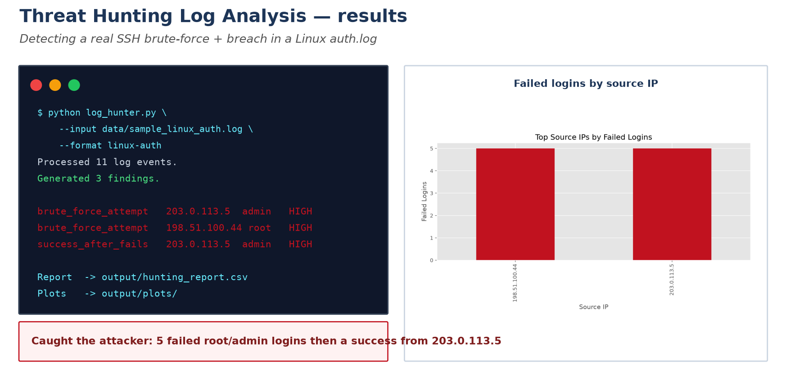
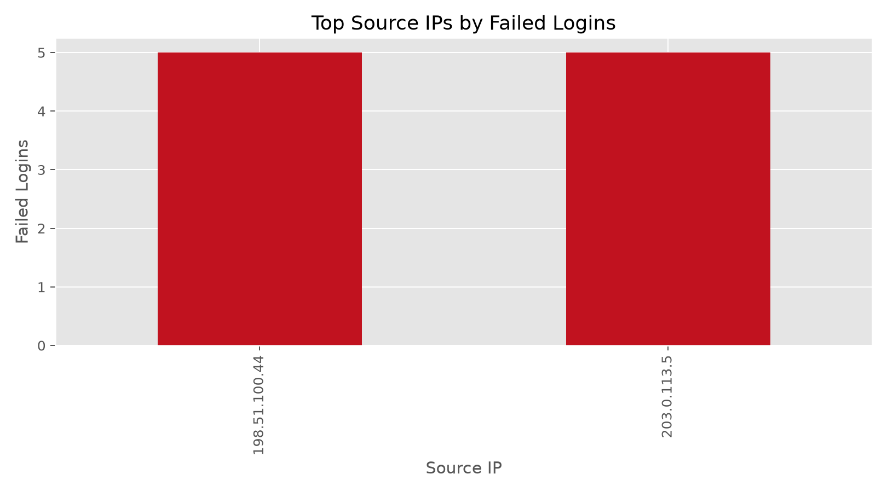
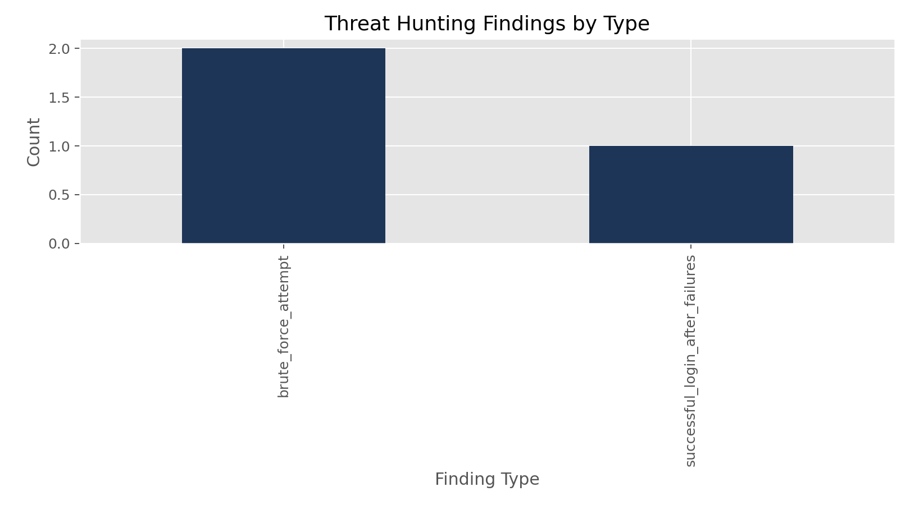

# Threat Hunting Log Analysis

This project analyzes authentication data to identify brute-force behavior, suspicious successful logins after repeated failures, and source IPs with unusual activity patterns.

## Results at a glance



Run against a Linux `auth.log`, the tool processes the events, correlates repeated
failures into brute-force findings, and flags the successful login that follows —
catching the attacker at `203.0.113.5` who guessed the `admin` password after five
failures. See [PAPER.md](PAPER.md) for the method and [JOURNAL.md](JOURNAL.md) for the
development notes.

It supports three input styles:

- normalized CSV authentication logs
- Linux `auth.log` style SSH events
- Windows Security event exports focused on logon activity

## Features

- multi-format log ingestion
- brute-force detection by source IP and username
- success-after-failures correlation
- unusual source IP activity detection
- exported findings report, summary, and plots
- lightweight notebook for investigation walkthroughs

## Project Structure

```text
.
|-- log_hunter.py
|-- requirements.txt
|-- .gitignore
|-- data/
|   |-- sample_auth_logs.csv
|   |-- sample_linux_auth.log
|   `-- sample_windows_security_events.csv
|-- assets/
|   |-- failed_logins_by_ip_sample.png
|   `-- findings_by_type_sample.png
`-- notebooks/
    `-- threat_hunting_walkthrough.ipynb
```

## Installation

```powershell
python -m pip install -r requirements.txt
```

## Usage

Run the normalized CSV sample:

```powershell
python log_hunter.py
```

Run a Linux auth log:

```powershell
python log_hunter.py --input data/sample_linux_auth.log --format linux-auth
```

Run a Windows Security event export:

```powershell
python log_hunter.py --input data/sample_windows_security_events.csv --format windows-events
```

## Output

The script writes:

- `output/hunting_report.csv`
- `output/summary.json`
- `output/plots/failed_logins_by_ip.png`
- `output/plots/findings_by_type.png`

## Sample Visuals

Failed logins by source IP:



Findings by type:



## Real-World Notes

This project is designed around common authentication telemetry:

- Linux SSH failures often appear in `auth.log` as `Failed password` and `Accepted password` records
- Windows logon monitoring commonly uses Security events `4624` for successful logons and `4625` for failed logons

## Next Steps

- add time-window based burst detection
- enrich source IPs with geo or threat intel
- parse EVTX directly instead of CSV exports
- add a notebook for Windows-specific investigation examples
